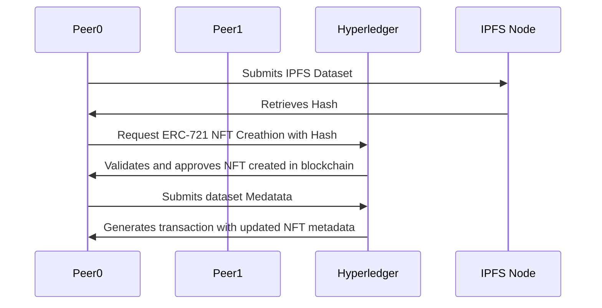
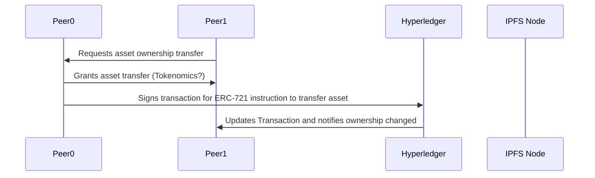

## Hyperledger NFT Creation (First time)

```mermaid
sequenceDiagram
    participant P0 as Peer0
    participant P1 as Peer1
    participant HYP as Hyperledger
    participant IPFS as IPFS Node
    P0->>IPFS: Submits IPFS Dataset
    IPFS->>P0: Retrieves Hash
    P0->>HYP: Request ERC-721 NFT Creathion with Hash
    HYP->>P0: Validates and approves NFT created in blockchain
    P0->>HYP: Submits dataset Medatata
    HYP->>P0: Generates transaction with updated NFT metadata
```

## Hyperledger NFT Transger```mermaid

```mermaid
sequenceDiagram
    participant P0 as Peer0
    participant P1 as Peer1
    participant HYP as Hyperledger
    participant IPFS as IPFS Node
    P1->>P0: Requests asset ownership transfer
    P0->>P1: Grants asset transfer (Tokenomics?)
    P0->>HYP: Signs transaction for ERC-721 instruction to transfer asset
    HYP->>P1: Updates Transaction and notifies ownership changed

```
